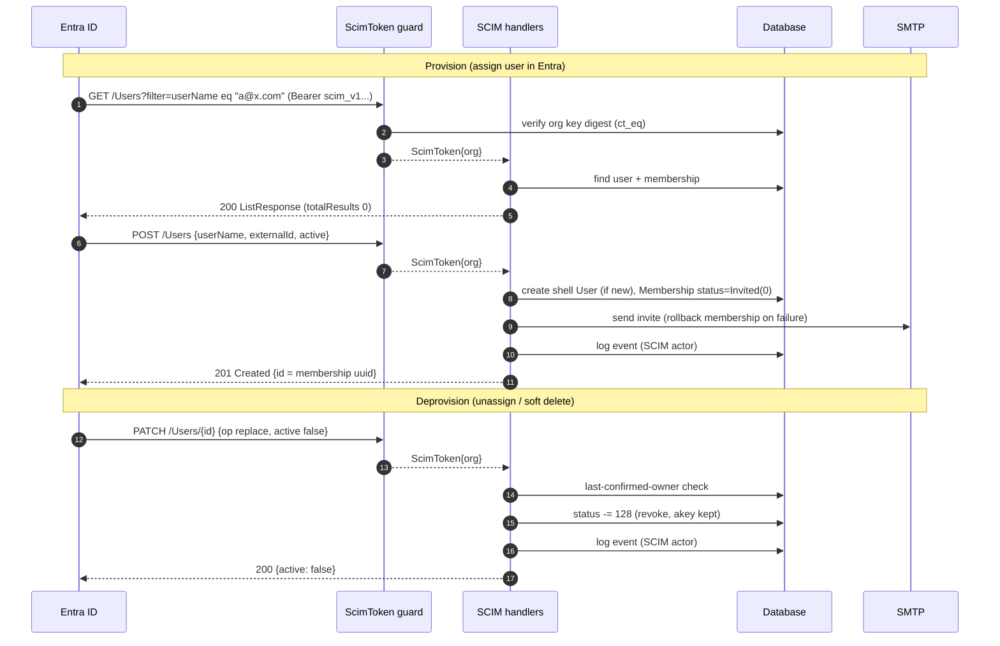
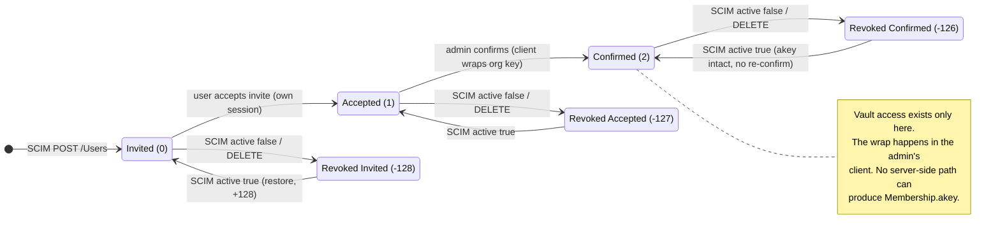
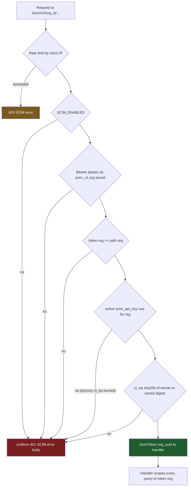
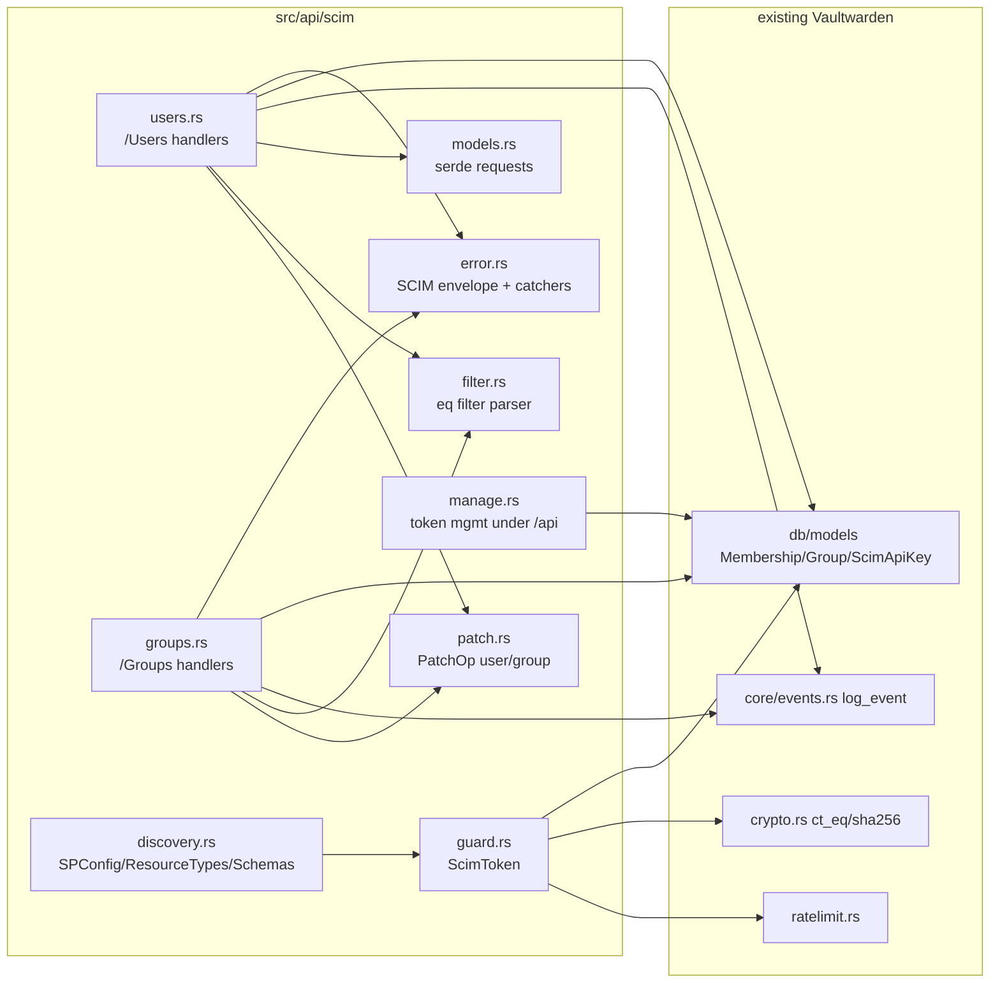

# SCIM v2 design

Architecture and security model for the SCIM implementation in this fork.
Operator instructions live in [README.md](README.md).

## Provision and deprovision flows

## Membership state machine

The revocation encoding is the one non-obvious invariant in the whole
integration: revoked is a stored **offset** (`status - 128`), and the enum
value `Revoked = -1` never reaches the database. Every active/inactive
decision in the SCIM code funnels through one helper that tests
`status <= -1`.

Why confirm cannot be automated server-side, verified against source:

- `Organization.private_key` is stored encrypted under the org symmetric key;
  the server cannot decrypt it.
- `confirm_invite_impl` only stores an opaque client-computed blob into
  `Membership.akey`.
- Account Recovery cannot substitute: enrollment is self-service and needs
  the user's master password, and `recover_account` requires the member to
  already be Confirmed. It is gated behind the state it would need to reach.

A future companion *confirm-worker* (a headless client holding an admin
account, wrapping keys client-side and posting `bulk_confirm_invite`) could
automate step three without weakening zero-knowledge. It is deliberately not
part of the server.

## Authentication

The credential is a per-organization static bearer token,
`scim_v1.<org_uuid>.<secret>`, because Entra's provisioning client sends a
fixed Secret Token and cannot run an OAuth flow (which rules out reusing the
one-hour organization api-key JWT that `/api/public` uses).

- The secret is 32 random bytes (256 bits). At rest it exists only as a
  sha256 hex digest in the `scim_api_key` table.
- sha256 instead of argon2 is deliberate: argon2's cost is protection for
  low-entropy human passwords. This secret is machine-generated at full
  entropy, so digest inversion is infeasible, while per-request argon2 on an
  unauthenticated endpoint would be a denial-of-service amplifier during
  Entra's sync bursts.
- Verification uses a constant-time compare, with a dummy compare when no
  key row exists. The dominant timing signal is still the database lookup;
  the dummy compare is hygiene, not a timing-proof guarantee.
- An active `scim_api_key` row is also the per-org enable switch; the global
  `SCIM_ENABLED` config is the master gate. Both must hold.
- Generation and rotation require an interactive org admin session plus
  master-password or OTP re-authentication. Rotation replaces the row, so
  the previous token dies instantly. The plaintext is returned exactly once
  and never logged.

Every 401 leaving the mount is byte-identical regardless of which check
failed (asserted by test); causes are logged server-side only. Misses on
filters return empty lists and unknown ids return the same 404 as another
org's ids, so the surface does not confirm what exists.

## Module layout

The `/scim` mount carries its own catchers so every error, including ones
Rocket generates before a handler runs, is a SCIM `Error` envelope. Token
management deliberately lives under `/api` with `AdminHeaders`: the SCIM
surface itself can never mint or rotate its own credential.

## Semantics that differ from a naive SCIM reading

| Topic | Choice | Reason |
|---|---|---|
| DELETE /Users | revoke, not delete | preserves `akey`; restore is lossless; compromised token cannot destroy state |
| Roles | not synced (always User) | `Custom` collapses to Manager in `MembershipType::from_str`; no honest round-trip |
| userName/displayName updates | accepted, ignored | email is login identity; `user.name` is global to the person; erroring would fail every directory rename sync |
| Group DELETE | real delete | groups carry no E2EE state |
| Group members | diff add/remove; replace only on PUT/replace | Entra PATCHes diffs, including `members[value eq "..."]` removal paths |
| Groups when disabled | loud 501 | `ldap_import` silently skips; silence hides misconfiguration in the IdP |
| Filter misses | empty 200 list | Entra Test Connection probes a random user; distinguishable misses enable enumeration |

## Test strategy

All tests are inline (bin-only crate). The integration harness runs the real
Rocket router with a temporary sqlite database. A `#[ctor]` constructor in
the `test-support` workspace crate rewrites the process environment before
`main`, because `CONFIG` is a process-global that reads `.env` at first
touch: without this, tests would inherit the developer's live configuration.
The main crate forbids `unsafe`, so the `set_var` calls live in
`test-support`. Integration tests serialize on a mutex and share one
never-dropped pool (sqlite WAL locking).

Covered end to end: the full provision / deprovision / restore lifecycle at
every status offset (`-126`, `-127`, `-128`), duplicate and last-owner
conflicts, uniform-401 byte-equality, enumeration shape, Entra PATCH quirks
(op casing, string booleans, path-less values, filter-path member removal),
pagination edges, and the rate limiter.
